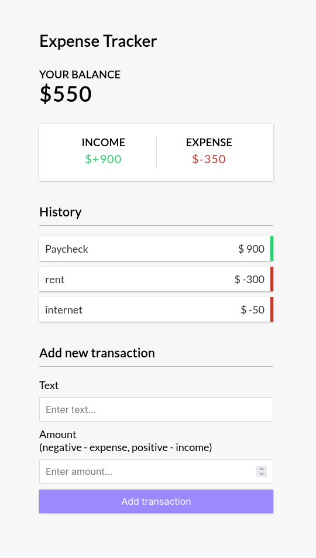

# 💸 Expense Tracker (Vue.js)

A minimal expense tracker app built with Vue 3. Add income/expenses, see your balance, and store everything in `localStorage`.



## ⚙️ Features

- Add/remove transactions
- Real-time balance, income & expenses
- Persistent data with `localStorage`

## 🚀 Usage

```bash
npm install
npm run dev
```

📦 Build

```bash
npm run build
```
